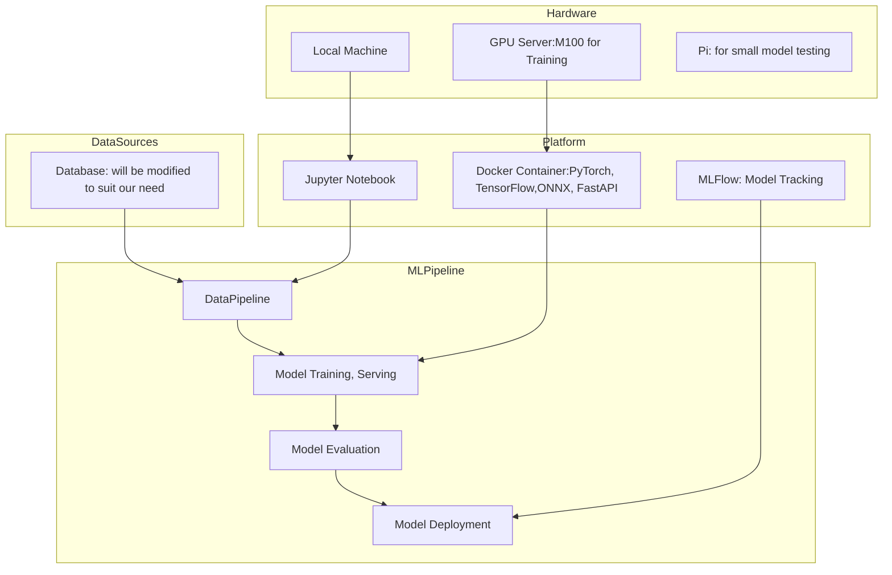
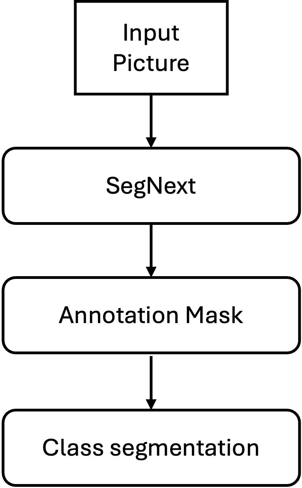

# MLSystemProject_rc5018_jt4850_sj4025

## Plant leaf health condition detector (RC) （Unit 1 requirement)

<!-- 
Discuss: Value proposition: Your will propose a machine learning system that can be 
used in an existing business or service. (You should not propose a system in which 
a new business or service would be developed around the machine learning system.) 
Describe the value proposition for the machine learning system. What’s the (non-ML) 
status quo used in the business or service? What business metric are you going to be 
judged on? (Note that the “service” does not have to be for general users; you can 
propose a system for a science problem, for example.)
-->

<!-- 
Robot: embed system, light model, memory
Disease in different plants with specific disease
Scalable for model training, do not need to train for whole model when discovering a new disease for one plant. Just need to train the submodel
Easy for re-training.The model consists of two submodels: classification for plant categories and another disease identification model. They work sequatially.
status quo used in the business or service
infernce time, accuracy, memory usage
-->

This project aims to build a large-scale, real-time plant disease segmentation model designed for integration into Solix Ag Robotics platforms. By leveraging high-resolution, close-range plant imagery, the model can accurately identify and localize a wide variety of crop diseases. This enables Solix’s robotic arms to perform targeted pesticide application or flag severely infected crops for manual intervention. Although the system does not currently map specific pesticides to plant types, it significantly enhances operational efficiency through precise, automated disease response.
Our value proposition lies in providing an intelligent, scalable vision solution that improves crop health monitoring, reduces chemical usage, and supports data-driven agricultural automation. The model is optimized for edge deployment, making it ideal not only for large field robotics but also for future lightweight greenhouse systems envisioned by Solinftec.
This project is developed using open-source resources, including the PlantSeg dataset—featuring detailed, ground-level images of diseased plants—and publicly available code repositories hosted on GitHub, ensuring transparency, reproducibility, and extensibility.

### Contributors

<!-- Table of contributors and their roles. 
First row: define responsibilities that are shared by the team. 
Then, each row after that is: name of contributor, their role, and in the third column, 
you will link to their contributions. If your project involves multiple repos, you will 
link to their contributions in all repos here. -->

| Name                            | Responsible for |
|---------------------------------|-----------------|
| Ruibin Chen                     |  model training |
| Shizhen Jia                     |  model serving  |
| Jialin Tian                     |  data pipeline  |

### System diagram (JT)(Some of Unit 2 requirements)

<!-- Overall digram of system. Doesn't need polish, does need to show all the pieces. 
Must include: all the hardware, all the containers/software platforms, all the models, 
all the data. -->

Note that our project will run on the Chameleon infrastructure in order to suit the Unit 2 requirment Infrastructure. 
And this project will be developed as a cloud-native service, which you should expect more information about this in section Continuous X. 

### Summary of outside materials (RC)

<!-- In a table, a row for each dataset, foundation model. 
Name of data/model, conditions under which it was created (ideally with links/references), 
conditions under which it may be used. -->

|                   | How it was created          | Conditions of use                                            |
| ----------------- | --------------------------- | ------------------------------------------------------------ |
| Plantseg115       | Download from the website   | Dataset for training                                         |
| PlantSeg(SegNext) | Git clone from the git repo | The training engine and framework that used to train and validate the model |

The dataset is downloaded from the Zenodo https://zenodo.org/records/14935094 
the author is 
While the Training framework PlantSeg is downloaded from the git repo https://github.com/tqwei05/PlantSeg.git
with respect to the author Wei el. 

### Summary of infrastructure requirements (SJ)

<!-- Itemize all your anticipated requirements: What (`m1.medium` VM, `gpu_mi100`), 
how much/when, justification. Include compute, floating IPs, persistent storage. 
The table below shows an example, it is not a recommendation. -->

| Requirement     | How many/when                                     | Justification |
|-----------------|---------------------------------------------------|---------------|
| `m1.medium` VMs | 3 for entire project duration                     | ...           |
| `gpu_rtx6000`    | 6 hour block twice a week                         |               |
| Floating IPs    | 1 for entire project duration, 1 for sporadic use |               |
| etc             |                                                   |               |

### Detailed design plan

<!-- In each section, you should describe (1) your strategy, (2) the relevant parts of the 
diagram, (3) justification for your strategy, (4) relate back to lecture material, 
(5) include specific numbers. -->

#### Model training and training platforms (RC)(Unit 4 and Unit 5)

<!-- Make sure to clarify how you will satisfy the Unit 4 and Unit 5 requirements, 
and which optional "difficulty" points you are attempting. -->

#### 1. Modeling
This project aims to achieve the multi-class segmentation task on the wild plant disease. SegNext showed strong Generalization on Natural Images, which is suitable for the wild plants disease. Additionally, we aim to deploy the model on an edge such as the agricultural robot, segNext has high performance with lightweight design.

Precisely figuring out the disease and the location is a typical multi class segmentation problem. The model will take a picture as the input and then apply the segmentation on the pixels. Therefore, the model is trained based on an image and its relative annotation mask. On the mask, the pixels related to the diseases will be labeled with specific class id. And other pixels are labeled as 0, the background. The model learned how to label the pixels and segment the picture to show the disease. 

During the inference stage, the model takes an image as input and output the annotation. The mask than can be drawn added to the image to visualize the labeling results. The Robotics can utilize the segmentation results to operate on the plants.

#### 2. Training
The model utilized the mmseg engine, which supports modular model selection. On the base code of the segNext, I added the MLFlow tracking process to log the experiment settings and log the best final results. 

The training file is shown at [train.py](./train/train.py) It is modified from the original sample code to add the mlflow tracking code. It will finnally call the provided dataset file [plantseg115.py](./train/plantseg115.py) and the config file [segnext_mscan-t_1xb16-adamw-40k_plantseg115-512x512.py](./train/segnext_mscan-t_1xb16-adamw-40k_plantseg115-512x512.py)

#### 3. Experiment tracking
As shown in the training code, I apply the MLFlow to tack the experiment. The model matrics such as Mean Intersection over Union (mIoU), Overall Accuracy (aAcc) is aimed to logged in the model. However, due to  the dataset labeling mismatch (possible reason), the model cannot be trained correctly at this time. The MLflow UI shows several failed training session and some successful experiments. The model archifacts are saved in the MLFlow.

#### 4. Scheduling training jobs
I build up the ray-cluster on the single compute liqid GPU node. Use rclone to mount the dataset from the object storage. Customized the [Dockerfile](./train/Dockerfile) to install required dependencies for segNext experiment. Design the docker-compose file [docker-compose-ray.yaml](./train/docker-compose-ray.yaml) to mount the data, code repo and build up the ray containers. 

#### 5. Traning strategies (partial)
Due to the limitation GPU resources, we could only train on a A100 40GB gpu server, which cannot meet the best training requirements. For example, the initial batch size is 16, which immediately get the CUDA out of the memory. Hence, I reduce the batch size to 8 and 4. The larger batch is designed to have higher speed. Hence, I turned on the amp (Automatic Mixed Precision), but it extremely prolong the training time. The amp may cost additional overhead for small batch size. Therefore, I reduce the batch size and increase the iteration times. 

| Batch size | AMP  | Iteration times | mIoU    | aAcc    | mAcc  | Training time |
| ---------- | ---- | --------------- | ------- | ------- | ----- | ------------- |
| 16         |      |                 |         |         |       | Fail          |
| 4          | No   | 10 k            | 19.4000 | 86.0900 | 29.42 | 1h 6m         |
| 8          | Yes  | 10 k            | 30.5300 | 87.5800 | 43.76 | 1h 36m        |
| 4          | No   | 20 k            | 28.0100 | 87.0100 | 42.01 | 2h 12m        |

For the further plan, I will select to train on Batch size 8 with more iteration rounds.

#### Model Serving and Monitoring Platforms (SJ)(Unit 6 and Unit 7)

<!-- 
Make sure to clarify how you will satisfy the Unit 6 and Unit 7 requirements, 
and which optional "difficulty" points you are attempting. 
-->

#### 1. Model Serving

##### 1.1. API Endpoint
- Unified REST API (FastAPI/Flask) wraps both the leaf-variety and disease-classification models.  
- Receives an image, routes to the appropriate model(s), and returns the final disease prediction.

##### 1.2. Key Requirements
- **Latency**: Sub-500ms response for single images.  
- **Throughput**: 5–10 concurrent requests in a cloud environment.

##### 1.3. Model Optimizations
- **Graph Compilation**: Operator fusion, constant folding, hardware-specific kernels.  
- **Reduced Precision**: FP16/INT8 quantization.  
- **Pruning / Distillation** (optional): Further compression for faster inference.

##### 1.4. System Optimizations
- **Warm Starts**: Keep models loaded in memory for minimal startup latency.  
- **Concurrent Execution**: Multiple replicas (auto-scaling) with load balancing.  
- **Dynamic Batching**: Combine requests for improved GPU/CPU utilization.  
- **Ensembling** (extra complexity): If multiple models are needed, trade off added latency for higher accuracy.

##### 1.5. Deployment
- **Cloud**: Scalable, powerful hardware; subject to network latency.  
- **Edge**: Low/no network latency; typically requires smaller, resource-friendly models.

<!-- --- -->

#### 2. Evaluation & Monitoring

##### 2.1. Offline Evaluation
- **General Metrics**: Loss, accuracy, F1; domain-specific (BLEU, ROUGE, perplexity).  
- **Slice-Based Evaluation**: Performance on subsets (rare diseases, specific leaf varieties).  
- **Operational Metrics**: Inference latency, throughput, memory footprint, retraining cost/time.  
- **Behavioral Testing**: Template-based tests verifying robustness to benign perturbations.  
- **Explainability**: SHAP, LIME, saliency maps.  
- **Regression Testing**: Verify fixes for known errors remain fixed.

##### 2.2. Automated Testing Pipeline
- Integrate all offline tests into a CI/CD pipeline.  
- Optional **human-in-the-loop** or **GenAI-in-the-loop** for deeper or “red team” testing.

##### 2.3. Online Evaluation
- **Shadow Testing**: Duplicate live user requests to the new model (not shown to users).  
- **Canary Testing**: Route a small fraction of live traffic to the new model, monitor key metrics.  
- **A/B Testing**: Split production traffic and measure business metrics (CTR, revenue).

##### 2.4. Production Monitoring
- **Drift Detection**: Monitor input distribution (covariate shift), label frequencies (label shift), and concept drift.  
- **Alerts**: Trigger notifications when performance degrades.  
- **Delayed/Partial Labels**: Incorporate user feedback or delayed ground truth as available.  
- **Human Labeling Pipeline**: Sample uncertain/high-impact predictions to refresh labels.

##### 2.5. Closing the Loop
- **Periodic Retraining**: Re-train with new data if performance drops below thresholds.  
- **Data Maintenance**: Maintain updated, high-quality data sets for incremental model improvements.

### Data pipeline (JT)(Unit 8)
You can read the file for a more detailed walk thorgh of dapa pipeline https://github.com/Ruibin2000/MLSystemProject_rc5018_jt4850_sj4025/blob/main/dapa_pipeline/create_vm_for_data_pipeline.ipynb.  
and also the set up for block for mlflow is avablible here https://github.com/Ruibin2000/MLSystemProject_rc5018_jt4850_sj4025/blob/main/dapa_pipeline/docker-compose-block.yaml

<!-- Make sure to clarify how you will satisfy the Unit 8 requirements,  and which 
optional "difficulty" points you are attempting. -->
#### 1.1 Persisten storage
- To satify this persisten storage, we used chi@tacc to store our data and also our data that was trained and all the artifacts we have such as models. The trained model will be pushed by mlflow in dir /mnt/block/minio_data and the command is available at this file here https://github.com/Ruibin2000/MLSystemProject_rc5018_jt4850_sj4025/blob/main/dapa_pipeline/create_vm_for_data_pipeline.ipynb

#### 1.2 Offline data 
- We will store our data that for training like pictures, josn file in /mnt/object, this data was create by the following data pipelins(using etl)

#### 1.3 Data pipelines 
- We plan to implement a modular ETL pipeline that ingests offline image data, no need for changing the file structure cause the data was great for training. and the code can be see here for build up the docker.
- https://github.com/Ruibin2000/MLSystemProject_rc5018_jt4850_sj4025/blob/main/dapa_pipeline/docker-compose-etl

#### 1.4 Online data
- we plan to depoly our model on a mass GPU for online cloud serving, which can be see here https://github.com/Ruibin2000/MLSystemProject_rc5018_jt4850_sj4025/blob/main/dapa_pipeline/data_coming_gpu.py
- and also depoly our model on edge device, which the simulate incoming data can be view here https://github.com/Ruibin2000/MLSystemProject_rc5018_jt4850_sj4025/blob/main/dapa_pipeline/edge_data_incoming.py
- and the different between this 2 is the edge only takes 1 pic every 30s, and gpu can take 200 pic in 1 batch. that is because our model is a bit huge for edge device, so I set the number as this. 

#### Continuous X (SJ)

<!-- Make sure to clarify how you will satisfy the Unit 3 requirements,  and which 
optional "difficulty" points you are attempting. -->

Use python-chi to provision compute, networking, and storage in a Git-managed, declarative fashion. All infrastructure definitions (VM size, networks, IPs) reside in a single repository. Post-provisioning, Ansible playbooks install necessary OS dependencies, container runtimes, and orchestrate microservice configurations on each node.

Each microservice is packaged as a Docker container, adhering to a single responsibility and communicating through lightweight APIs. This microservices architecture allows independent updates and scaling based on demand. A centralized CI/CD pipeline automatically trains and tests machine learning models, bundles them into container images, and pushes these images to a registry. It then deploys to a staging environment for integration and performance tests, followed by canary deployment in production. Real user traffic is gradually shifted to the new release; if metrics deviate from set thresholds, the pipeline triggers an automated rollback.

For observability, container logs and performance metrics flow into systems like Prometheus or Elasticsearch. Alerts notify operators of high error rates or latency issues. Incident resolution playbooks live in the same Git repository, ensuring uniform handling of operational events. By combining python-chi for provisioning, Ansible for configuration, and robust CI/CD with staged deployments, this design enables continuous improvement while minimizing risks to the production environment.

##### Difficulty Points
###### Unit 1: Multi-Models
###### Unit 8: Interactive data dashboard

##### Add one more sub-model
##### Retrain one sub-model add on new label

