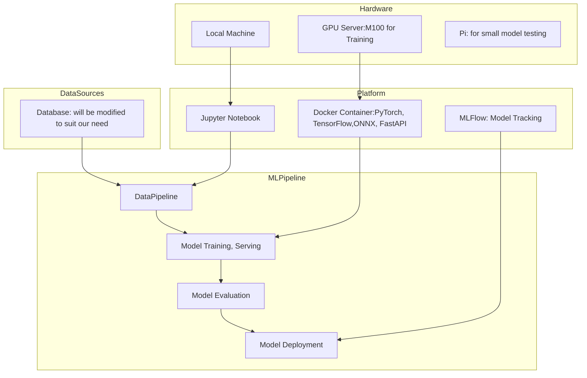
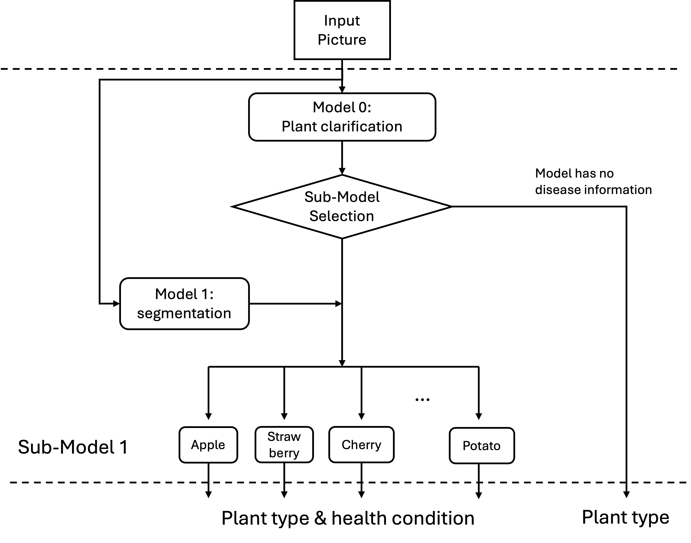

# MLSystemProject_rc5018_jt4850_sj4025

## Plant leaf health condition detector (RC)

<!-- 
Discuss: Value proposition: Your will propose a machine learning system that can be 
used in an existing business or service. (You should not propose a system in which 
a new business or service would be developed around the machine learning system.) 
Describe the value proposition for the machine learning system. What’s the (non-ML) 
status quo used in the business or service? What business metric are you going to be 
judged on? (Note that the “service” does not have to be for general users; you can 
propose a system for a science problem, for example.)
-->

<!-- 
Robot: embed system, light model, memory
Disease in different plants with specific disease
Scalable for model training, do not need to train for whole model when discovering a new disease for one plant. Just need to train the submodel
Easy for re-training.The model consists of two submodels: classification for plant categories and another disease identification model. They work sequatially.
status quo used in the business or service
infernce time, accuracy, memory usage
-->

As the global population grows, so does the demand for food production. Early and accurate detection of plant diseases is crucial for maintaining crop health and yield. Many agricultural businesses already use imaging tools, but disease diagnosis often relies on manual comparison with libraries or expert consultation—methods that are costly, slow, and difficult to scale.

We propose a machine learning system that integrates into existing agricultural workflows to automate plant disease detection from leaf images. The system features two sub-models: one for plant species classification and another for disease identification. This modular design allows efficient retraining—only the relevant sub-model needs updating when a new disease is discovered.

The value proposition lies in reducing diagnostic time and cost while improving accuracy. Designed to be lightweight and suitable for embedded systems or robots, the model offers a scalable, affordable upgrade to current agricultural practices.

### Contributors

<!-- Table of contributors and their roles. 
First row: define responsibilities that are shared by the team. 
Then, each row after that is: name of contributor, their role, and in the third column, 
you will link to their contributions. If your project involves multiple repos, you will 
link to their contributions in all repos here. -->

| Name                            | Responsible for | Link to their commits in this repo |
|---------------------------------|-----------------|------------------------------------|
| Ruibin Chen                     |  model training |                                    |
| Shizhen Jia                     |  model serving  |                                    |
| Jialin Tian                     |  data pipeline  |                                    |

### System diagram (JT)

<!-- Overall digram of system. Doesn't need polish, does need to show all the pieces. 
Must include: all the hardware, all the containers/software platforms, all the models, 
all the data. -->

### Summary of outside materials (RC)

<!-- In a table, a row for each dataset, foundation model. 
Name of data/model, conditions under which it was created (ideally with links/references), 
conditions under which it may be used. -->

|              | How it was created | Conditions of use |
|--------------|--------------------|-------------------|
| Plant Categories   |   merge from original plant dataset for plants class    |      used for the first-layer model for plant classification      |
| Diseases Categories   |    extract from plant dataset to create sub datasets of diseases for different plants      |      used for second-layer diseases detector    |
| MobileNetV2 |    import from the Pytorch application and finetune                |  candidate for edge user, robot       |
| EfficientNetB7         |     import from the Pytorch application   |      candidate for the cloud traning (high accuracy)             |
| llma 3B, 7B, 13B    | import from openllm as lab | candidate for the cloud training |

### Summary of infrastructure requirements (SJ)

<!-- Itemize all your anticipated requirements: What (`m1.medium` VM, `gpu_mi100`), 
how much/when, justification. Include compute, floating IPs, persistent storage. 
The table below shows an example, it is not a recommendation. -->

| Requirement     | How many/when                                     | Justification |
|-----------------|---------------------------------------------------|---------------|
| `m1.medium` VMs | 3 for entire project duration                     | ...           |
| `gpu_mi100`     | 4 hour block twice a week                         |               |
| Floating IPs    | 1 for entire project duration, 1 for sporadic use |               |
| etc             |                                                   |               |

### Detailed design plan

<!-- In each section, you should describe (1) your strategy, (2) the relevant parts of the 
diagram, (3) justification for your strategy, (4) relate back to lecture material, 
(5) include specific numbers. -->

#### Model training and training platforms (RC)

<!-- Make sure to clarify how you will satisfy the Unit 4 and Unit 5 requirements, 
and which optional "difficulty" points you are attempting. -->

#### 1. Model traning at scale (unit 4)
##### 1.1 Train and re-train
Our selected candidate models can be trained on the required datasets and fine-tuned at scale to fit specific dataset for better performance. For large model training, we plan to use mutiple GPU to accelarate the training process.
With the benefit of our design on the two layers model, further discovered diseases of a specific plant only need to re-train the layer-2 model without training on layer-1 model. It is easy for re-training.

##### 1.2 well-justified choices for modeling.
For first layer model which classifies the type of the plants, the model needs to train on a large dataset. 
While the sub-layer model may train on the smaller datasets with higher accuracy.
Additionally, the performance of models on specific disease can be different. 
These model will be compared and selected based on the test datasets

#### 2. Model training infrastructure and platform (unit 5)
##### 2.1 Experiment tracking
The following training plan are proposed to run:
- MobileNetV2 trains on the plant categories
- MobileNetV2 trains on the disease categories
- EfficientNetB7 trains on the plant categories
- EfficientNetB7 trains on the disease categories
- llma 3B trains on the plant categories
- llma 3B trains on the disease categories
- llma 7B trains on the plant categories
- llma 7B trains on the disease categories
- llma 13B trains on the plant categories
- llma 13B trains on the disease categories

MLFlow experiment tracking server on Chameleon will be hosted to track and evaluate the experiment details

##### 2.2 Scheduling training jobs
Like the lab, a Ray cluster will be implemented and run on the server. The required training jobs will be submitted in pipline.

#### Model Serving and Monitoring Platforms (SJ)

<!-- 
Make sure to clarify how you will satisfy the Unit 6 and Unit 7 requirements, 
and which optional "difficulty" points you are attempting. 
-->

### 1. Model Serving

#### 1.1. API Endpoint
- Unified REST API (FastAPI/Flask) wraps both the leaf-variety and disease-classification models.  
- Receives an image, routes to the appropriate model(s), and returns the final disease prediction.

#### 1.2. Key Requirements
- **Latency**: Sub-500ms response for single images.  
- **Throughput**: 5–10 concurrent requests in a cloud environment.

#### 1.3. Model Optimizations
- **Graph Compilation**: Operator fusion, constant folding, hardware-specific kernels.  
- **Reduced Precision**: FP16/INT8 quantization.  
- **Pruning / Distillation** (optional): Further compression for faster inference.

#### 1.4. System Optimizations
- **Warm Starts**: Keep models loaded in memory for minimal startup latency.  
- **Concurrent Execution**: Multiple replicas (auto-scaling) with load balancing.  
- **Dynamic Batching**: Combine requests for improved GPU/CPU utilization.  
- **Ensembling** (extra complexity): If multiple models are needed, trade off added latency for higher accuracy.

#### 1.5. Deployment
- **Cloud**: Scalable, powerful hardware; subject to network latency.  
- **Edge**: Low/no network latency; typically requires smaller, resource-friendly models.

---

### 2. Evaluation & Monitoring

#### 2.1. Offline Evaluation
- **General Metrics**: Loss, accuracy, F1; domain-specific (BLEU, ROUGE, perplexity).  
- **Slice-Based Evaluation**: Performance on subsets (rare diseases, specific leaf varieties).  
- **Operational Metrics**: Inference latency, throughput, memory footprint, retraining cost/time.  
- **Behavioral Testing**: Template-based tests verifying robustness to benign perturbations.  
- **Explainability**: SHAP, LIME, saliency maps.  
- **Regression Testing**: Verify fixes for known errors remain fixed.

#### 2.2. Automated Testing Pipeline
- Integrate all offline tests into a CI/CD pipeline.  
- Optional **human-in-the-loop** or **GenAI-in-the-loop** for deeper or “red team” testing.

#### 2.3. Online Evaluation
- **Shadow Testing**: Duplicate live user requests to the new model (not shown to users).  
- **Canary Testing**: Route a small fraction of live traffic to the new model, monitor key metrics.  
- **A/B Testing**: Split production traffic and measure business metrics (CTR, revenue).

#### 2.4. Production Monitoring
- **Drift Detection**: Monitor input distribution (covariate shift), label frequencies (label shift), and concept drift.  
- **Alerts**: Trigger notifications when performance degrades.  
- **Delayed/Partial Labels**: Incorporate user feedback or delayed ground truth as available.  
- **Human Labeling Pipeline**: Sample uncertain/high-impact predictions to refresh labels.

#### 2.5. Closing the Loop
- **Periodic Retraining**: Re-train with new data if performance drops below thresholds.  
- **Data Maintenance**: Maintain updated, high-quality data sets for incremental model improvements.

#### Data pipeline (JT)

<!-- Make sure to clarify how you will satisfy the Unit 8 requirements,  and which 
optional "difficulty" points you are attempting. -->
##### For Persisten storage, the lab 8 haven't be released yet, but I assume we everyting inclueding model traning artifacts, test artifacts, models, container images and data can be stored on Chameloeon. 

##### Offline data, we will set up our data locally, and then upload it to Chameloeon for future traning and also so everyone in our group can access it. 

##### Data pipelines: We plan to implement a modular ETL pipeline that ingests offline image data, applies standardized preprocessing (resizing, normalization, optional segmentation masking), and structures the data with two levels of labels: leaf species and disease type. 

##### Online data: Will write a listening script to catch data from a directory, and then process using steps similar to process picture to fit our need for different model, but note that there is a segmented picture section in the model, so we need to train a segmentation model for online data only.
#### Continuous X (SJ)

<!-- Make sure to clarify how you will satisfy the Unit 3 requirements,  and which 
optional "difficulty" points you are attempting. -->
##### Difficulty Points
###### Unit 1: Multi-Models
###### Unit 8: Interactive data dashboard

